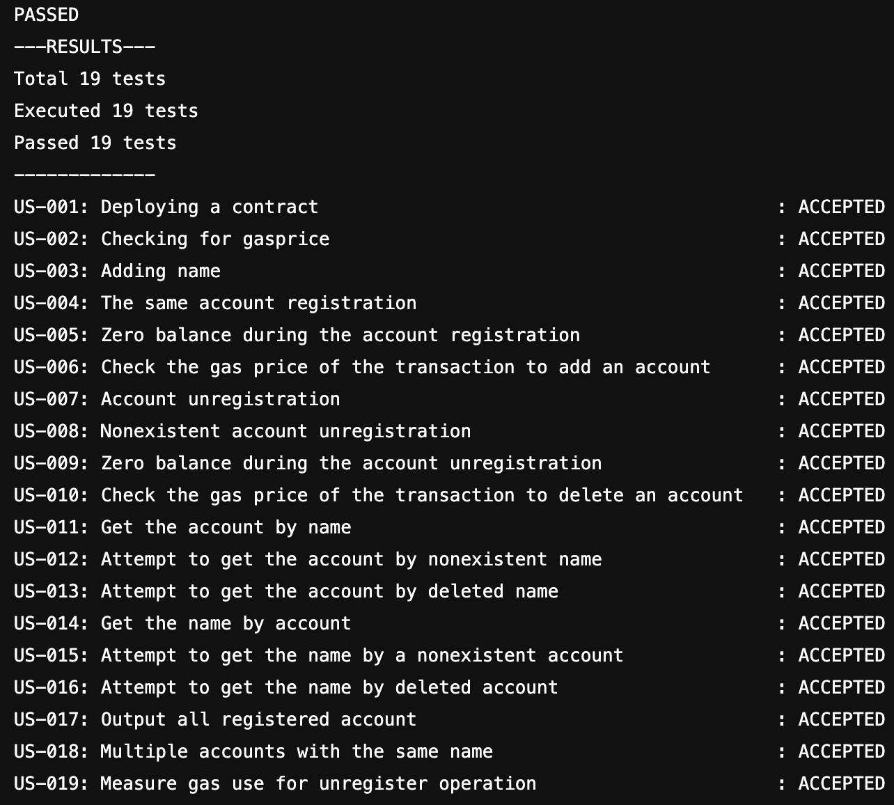

## Result



Assignement "Simple registrar on an Ethereum contract"
----

This repository is dedicated to keep the solution of the assignment "Simple registrar contract".

The task description can be found [here](task-description.md).

## Pre-requisites

First of all, you need to create a branch `develop` in this repository. Then clone the repository to you local machine and prepare the solution for the given task.

In fact, you need to develop a python script which MUST be called `registrar.py`.

The code of the contract, which will be used by your script, must be accessed from the corresponding git repository through [`git submodule`](https://git-scm.com/book/en/v2/Git-Tools-Submodules). The directory for the submodule within the registrar repo is `contract`. Initially, as you get the access to the registrar repositoty, the contracts will be taken from the latest commit in the `develop` branch of the contract repo.

So, after cloning the repo and creation of the `develop` branch, initialize the directory with submodule by execution `git submodule update --init`.

Further, if you update your contract in the contract repo, you need also update the submodule to point out on the corresponding commit.

Before starting the writing the code, you need to get familiar with the web3  python library. It is recommended to read its excellent [documentation](http://web3py.readthedocs.io/).

Install the library in your python environment. E.g. it could be done by executing:
```
$ pip install web3
```

This library will allow you to deploy contract in a blockchain networks compatible with EVM and execute the contract's code by making transaction or through the local calls.

### Solution verification

Take into account the requirements presented in the examples of [the task description](task-description.md). Your solution will be tested whether it satisfies these requirements. Moreover, the checker will also verify the contract separately assuming the it is located in `contracts/registrar.sol`.

Every time you `push` the changes to the `develop` branch the test of your solution will be started automatically. Result of tests will be available on GitLab server in the section `CI/CI -> Pipelines`. The solution checking is not instant, so, most probably usage of _try&fix_ approach is not effective strategy since will waste your time

If the tests were passed, you will see the corresponding green label on top of the list with pipelines.

If some tests are failed, the label will be red. Click on the label to see execution of exact test. You will see the log how your script was run with different parameters. 

Don't change .gitlab-ci.yml since it is used to run configured automated testing in GitLab.

The checker that is verifying your solution is configured with the following versions of software:
  * OS Linux
  * Python 3.8
  * Python library `web3` (5.9.0)
  * Solidity compiler `/usr/local/bin/solc` (0.5.17)

### Solution acceptance

As soon as you think that your solution is ready (completely or not), please create a _Merge Request_ in GitLab to merge changes from the `develop` branch to the `master` branch. Assign the Merge Request to the person who is responsible to grade it.